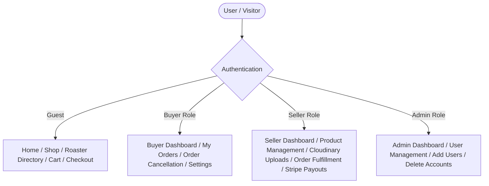

# ☕ Roaster's Market — Coffee Marketplace Frontend

[](https://nextjs.org/)
[](https://reactjs.org/)
[](https://www.typescriptlang.org/)
[](https://tailwindcss.com/)
[](https://stripe.com/)

A modern, full-featured specialty coffee marketplace frontend built with **Next.js (App Router)**, **React**, **TypeScript**, and **Tailwind CSS**. 

The platform bridges independent coffee roasters directly with coffee enthusiasts: roasters can set up digital storefronts, list single-origin and blend batches with detailed roast profiles, and manage payouts via Stripe Connect Express, while buyers enjoy a streamlined shopping and secure checkout experience.

> **Backend API Companion:** Built with ASP.NET Core (.NET 10 Web API), PostgreSQL, Cloudinary, and Stripe Connect.  
> - Repository: [mossstak/marketplace-api](https://github.com/mossstak/marketplace-api)  
> - Live Swagger Documentation: [Roaster's Market Swagger API](https://roastersmarket.onrender.com/swagger/index.html)  
> - Created by: **[Mostak Khan](https://github.com/mossstak)**

---

## 📑 Table of Contents

1. [Key Features](#-key-features)
2. [Role-Based Architecture](#-role-based-architecture)
3. [Tech Stack](#-tech-stack)
4. [Project Structure](#-project-structure)
5. [Getting Started & Installation](#-getting-started--installation)
6. [Environment Variables](#-environment-variables)
7. [Available Scripts](#-available-scripts)
8. [API & Services Integration](#-api--services-integration)
9. [Author & License](#-author--license)

---

## ✨ Key Features

### 🛒 Marketplace & Discovery
- **Dynamic Catalog & Search:** Browse specialty coffees with instant real-time search filtering across product names, origins, and roaster names.
- **Detailed Coffee Profiles:** Product pages displaying comprehensive bean specs:
  - Roast level (Light, Medium, Dark)
  - Processing method (Washed, Natural, Honey, Anaerobic, etc.)
  - Origin, Region, Producer, Varietal, and Elevation / Altitude (MASL)
  - Tasting notes and Roast date
  - Multi-variant selector (bag sizes, grind options, unit pricing, stock status)
- **Roaster Storefronts:** Dedicated roaster directory and profile pages (`/roaster/[roasterId]`) showcasing roastery bio, location, verified badges, website, and social links.
- **Interactive Shopping Cart:** Persistent client-side cart (`CartContext`) supporting multiple variants, quantities, and live price recalculations.

### 💳 Stripe Connect & Express Checkout
- **Custom Stripe Elements Integration:** Uses `@stripe/react-stripe-js` with both `PaymentElement` and `AddressElement` for smooth checkout and automated shipping tax jurisdiction detection.
- **Seller Express Payouts:** Direct integration with Stripe Connect Express onboarding flow, status monitoring (`chargesEnabled`, `payoutsEnabled`), and instant access to the Stripe Express seller dashboard.
- **Split Payments & Platform Fees:** Seamless backend communication handling destination charges and application fees.

### 🌓 UI / UX & Design
- **Theme Support:** Fully integrated dark and light modes powered by `next-themes`.
- **Responsive Layout:** Tailored experiences for mobile, tablet, and desktop viewports with collapsible navigation, mobile search, and drawer menus.
- **Accessible Components:** Built with Radix UI primitives and Lucide icons.

---

## 👥 Role-Based Architecture

The frontend provides dedicated layouts, navigation, and protected portals for three distinct user roles:



### 1. 🛍️ Buyer
- Access personal purchase history and order status tracking (`Pending`, `Paid`, `Shipped`, `Cancelled`).
- Cancel pending orders with automatic backend stock restoration.
- Update personal profile and change account passwords in `/settings`.

### 2. ☕ Seller (Roaster)
- **Profile Gate:** Automatic verification checking completeness before listing products (`SellerProfileGate`).
- **Storefront Editor:** Update public company details, bio, city, country, website, and Instagram handle.
- **Product Management:**
  - Create, view, edit, and delete coffee listings.
  - Multi-variant configuration (weight, stock quantity, pricing).
  - Direct Cloudinary image upload pipeline with backend-signed signatures (`useSellerImagePicker`).
- **Order Fulfillment:** Live dashboard tracking customer orders with one-click `Mark as Shipped` status updates.
- **Payouts Portal:** Connect bank accounts, verify identity via Stripe Express, and check payout statuses.

### 3. 🛡️ Admin
- Overview platform statistics and monitor registered roasters and buyers.
- Manage user accounts: inline editing of credentials and roles, account deletion, and direct user creation.

---

## 🛠 Tech Stack

| Category | Technology |
| :--- | :--- |
| **Framework** | [Next.js 16](https://nextjs.org/) (App Router, Server & Client Components) |
| **Language** | [TypeScript 5](https://www.typescriptlang.org/) |
| **UI Library** | [React 18](https://react.org/), [Radix UI](https://www.radix-ui.com/), [Lucide Icons](https://lucide.dev/) |
| **Styling** | [Tailwind CSS v4](https://tailwindcss.com/), `tw-animate-css` |
| **Theming** | [next-themes](https://github.com/pacocoursey/next-themes) |
| **HTTP Client** | [Axios](https://axios-http.com/) (JWT Interceptors & Auto Token Invalidation) |
| **Payments** | [Stripe.js](https://stripe.com/docs/js) & [Stripe React](https://stripe.com/docs/stripe-js/react) |
| **Asset CDN** | [Cloudinary](https://cloudinary.com/) (Direct secure signed image uploads) |

---

## 📁 Project Structure

```text
marketplace-frontend/
├── public/                     # Static assets and public media
├── src/
│   ├── api/
│   │   └── api.ts              # Axios instance, baseURL config & JWT interceptors
│   ├── app/                    # Next.js App Router routes
│   │   ├── admin/
│   │   │   └── dashboard/      # Admin dashboard, add-user, view-users
│   │   ├── buyer/
│   │   │   └── dashboard/      # Buyer order history and account dashboard
│   │   ├── cart/               # Shopping cart view
│   │   ├── checkout/           # Stripe payment & address checkout flow
│   │   ├── login/              # User authentication page
│   │   ├── register/           # Registration for Buyers and Sellers
│   │   ├── roaster/            # Roaster directory & [roasterId] public storefronts
│   │   ├── seller/
│   │   │   └── dashboard/      # Seller dashboard (products, orders, payouts, profile)
│   │   ├── settings/           # Account security & password update
│   │   ├── shop/               # Product catalog & [productId] detail view
│   │   ├── globals.css         # Global Tailwind CSS stylesheet
│   │   ├── layout.tsx          # Root layout with ThemeProvider & CartProvider
│   │   └── page.tsx            # Landing homepage with Hero & Featured Roasters
│   ├── auth/
│   │   ├── auth.ts             # JWT token storage and authentication helpers
│   │   └── roledirect.ts       # Role-based route redirection logic
│   ├── components/
│   │   ├── images/             # Cloudinary upload picker, gallery & selector
│   │   ├── theme/              # Dark/light theme provider and switcher button
│   │   ├── ui/                 # Reusable UI primitives (Button, Card, etc.)
│   │   ├── Cart.tsx            # Cart drawer / list component
│   │   ├── ChangePasswordForm.tsx
│   │   ├── DropdownAccount.tsx # User profile menu & logout control
│   │   ├── Header.tsx          # Responsive sticky navigation bar with search
│   │   ├── Hero.tsx            # Homepage hero banner
│   │   ├── ProductDetailClient.tsx # Variant picker & Add-to-Cart logic
│   │   ├── RoasterCarousel.tsx # Featured roasters carousel slider
│   │   ├── SearchBar.tsx       # Live search input component
│   │   ├── SellerProfileGate.tsx # Guard ensuring seller profile completeness
│   │   └── StripeCheckoutForm.tsx # Stripe Elements checkout wrapper
│   ├── context/
│   │   └── CartContext.tsx     # React Context for global shopping cart state
│   ├── hooks/
│   │   └── useSellerImagePicker.ts # Custom hook for Cloudinary signing & upload
│   ├── lib/
│   │   ├── stripe.ts           # Stripe client loader initialization
│   │   └── utils.ts            # Class merging and utility helpers (clsx/twMerge)
│   ├── paths.ts                # Route path constants
│   └── types/                  # TypeScript interfaces (Product, Roaster, User, Images)
├── components.json             # Shadcn / UI configuration
├── next.config.ts              # Next.js configuration (remote image patterns)
├── package.json                # Project dependencies and npm scripts
├── tsconfig.json               # TypeScript configuration
└── README.md                   # Project documentation
```

---

## 🚀 Getting Started & Installation

### Prerequisites
- **Node.js**: `v18.17.0` or higher (`v20.x` recommended)
- **Package Manager**: `npm`, `pnpm`, or `yarn`
- Running instance of the **ASP.NET Core Backend API** (locally or remote)

### 1. Clone the Repository
```bash
git clone https://github.com/mossstak/marketplace-frontend.git
cd marketplace-frontend
```

### 2. Install Dependencies
```bash
npm install
```

### 3. Configure Environment Variables
Create a `.env.local` file in the root directory:

```bash
cp .env .env.local
```

Populate `.env.local` with your configuration:

```env
# Backend API Base URL
NEXT_PUBLIC_API_URL=http://localhost:5000

# Stripe Publishable Key (from Stripe Dashboard)
NEXT_PUBLIC_STRIPE_PUBLISHABLE_KEY=pk_test_your_stripe_publishable_key
```

### 4. Run the Development Server
```bash
npm run dev
```

Open [http://localhost:3000](http://localhost:3000) in your browser to view the application.

---

## ⚙️ Environment Variables

| Variable | Required | Description | Example |
| :--- | :---: | :--- | :--- |
| `NEXT_PUBLIC_API_URL` | **Yes** | Base endpoint for the backend ASP.NET API | `http://localhost:5000` or `https://roastersmarket.onrender.com` |
| `NEXT_PUBLIC_STRIPE_PUBLISHABLE_KEY` | **Yes** | Stripe Publishable API Key for Stripe Elements | `pk_test_51...` |
| `BUILD_STANDALONE` | No | Set to `'true'` if generating a standalone Docker build | `true` |

---

## 📜 Available Scripts

| Script | Command | Purpose |
| :--- | :--- | :--- |
| `dev` | `npm run dev` | Starts Next.js development server on `http://localhost:3000` with hot-reloading |
| `build` | `npm run build` | Compiles and builds the production bundle |
| `start` | `npm run start` | Runs the production build server |
| `lint` | `npm run lint` | Runs ESLint to check for syntax and type issues |

---

## 🔗 API & Services Integration

- **Backend API Communication:**
  The frontend uses an Axios client instance configured in [`src/api/api.ts`](file:///src/api/api.ts). It automatically attaches the JWT bearer token stored in `localStorage` to all authenticated requests and handles expired session (401) cleanup.
- **Image Management:**
  Image uploading uses a signed direct upload workflow to **Cloudinary**. The frontend requests a short-lived signature from the backend (`/seller/images/sign`), uploads directly to Cloudinary's API, and attaches the resulting public URL and ID to the product payload.
- **Payment Processing:**
  Stripe Payment Intents are generated dynamically on order initiation (`/api/StripeConnect/create-payment-intent`) and confirmed on the client side before recording the finalized order (`/Order/place`).

---

## 📄 Author & License

Created with ❤️ by **[Mostak Khan](https://github.com/mossstak)**.  
Feel free to open issues and submit pull requests to contribute!

